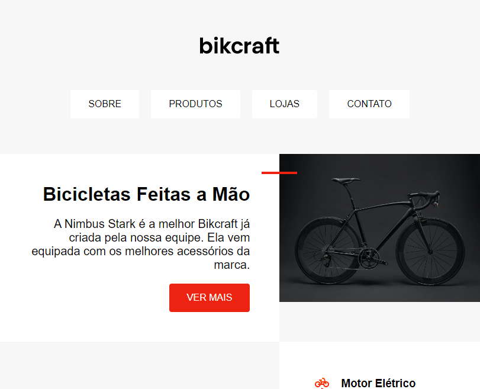

# 🚲 Projeto BikCraft

> Origamid

Projeto de estudo feito para o curso da ORIGAMID, com foco em treinar o conceito de posicionamento utilizando display : flex e display : grid.

[🔗 Clique aqui para acessar](https://caminsk.github.io/project-bikcraft/)

## 👨‍💻 Refatoração 29.09.22

- Adicionado tags Semânticas
- Mudança de unidade de Px para Rem
- Algumas interações utilizando Pseudo Classes

## 🛠 Tecnologias

- HTML
- CSS
- Git e GitHub

## ❤ Contato

matheus.caminsk@gmail.com
